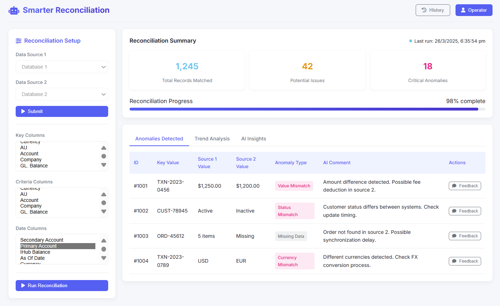

# 🚀 SMARTER RECONCILIATION

## 📌 Table of Contents
- [Introduction](#introduction)
- [Demo](#demo)
- [Inspiration](#inspiration)
- [What It Does](#what-it-does)
- [How We Built It](#how-we-built-it)
- [Challenges We Faced](#challenges-we-faced)
- [How to Run](#how-to-run)
- [Tech Stack](#tech-stack)
- [Team](#team)

---

## 🎯 Introduction
**Subject**: Proposal for Automation of Branch Banking Reconciliation Utilizing Retrieval-Augmented Generation and Large Language Models

This tool addresses the critical process of reconciliation within the banking ecosystem, a function paramount to the meticulous management and accurate accounting of client funds. The imperative to ensure precise alignment between general ledger (GL) balances and inter-system transactional data necessitates a robust and reliable reconciliation framework.

The reliance on manual reconciliation procedures presents inherent challenges, including protracted processing times and an elevated susceptibility to human error. Consequently, we propose the exploration and implementation of an automated solution leveraging Retrieval-Augmented Generation (RAG) and Large Language Models (LLMs). This approach holds the potential to significantly augment the efficiency and accuracy of the operational personnel’s workflow, thereby mitigating the aforementioned risks.
The deployment of RAG and LLMs is anticipated to yield the following benefits:
•	Enhanced Efficiency: Automation of data collation and comparison, thereby reducing processing time.
•	Improved Accuracy: Minimization of human error through algorithmic precision.
•	Accelerated Reconciliation: Expedited identification and resolution of discrepancies.
•	Operational Optimization: Liberation of operational personnel from repetitive tasks, enabling focus on strategic initiatives.


## 🎥 Demo
📹 [Video Demo](./artifacts/demo/Video.mp4) (if applicable)  

🖼️ Screenshots:



## 💡 Inspiration
Here's a description of your proposed solution, incorporating the key features and benefits you've outlined:
**Problem:**
Reconciling millions of records in the banking sector is a complex, time-consuming, and error-prone process, demanding extensive analysis and posing significant operational challenges.
**Proposed Solution**: **RAG-Powered Reconciliation Assistant**
Our solution is to provide operational personnel with an intelligent assistant that leverages Retrieval-Augmented Generation (RAG) to streamline and enhance the reconciliation process. This assistant will empower users to:
•	Make effective, informed decisions: By providing immediate access to relevant data and insights.
•	Make data-driven decisions: Through comprehensive data analysis and visualization capabilities.
•	Access all reconciliation data analytics in one place: Consolidating information from disparate systems into a unified platform.
**Key Features and Uniqueness:**
•	**Continuous Learning**: The RAG system will be designed for continuous learning. It will incorporate feedback from operational personnel, such as corrections to anomaly classifications (e.g., a user identifying a record flagged as an anomaly as actually being normal). This feedback loop will enable the RAG and LLM to refine their models and improve accuracy over time.
•	**Anomaly Confidence Scoring**: The assistant will provide a confidence score for records identified as anomalies. This score will indicate the level of certainty the RAG system has in its classification, allowing users to prioritize their review efforts and make more informed judgments.
•	**Comprehensive Data Access**: The system will gather and process data from all relevant sources, providing a holistic view of the information required for reconciliation.
•	Efficiency Gains: By automating much of the manual work currently done by operational staff.
•	**Reduced Errors**: By minimizing the risk of human error in the reconciliation process.
•	**Performance**: The rate at whihc Millions of records are processed is vert success factor. We would implemnt either Hashing or Sorting techniques to get to the records navigation faster


## ⚙️ What It Does
Our solution is an intelligent assistant that leverages Retrieval-Augmented Generation (RAG) to streamline and enhance the reconciliation process. The tool allows users to:
•	Select two reconciliation files for comparison.
•	Specify key columns, reconciliation criteria, and date columns.
The RAG implementation then compares records and classifies them into the **following categories**:
•	Consistent: GL and IHub balances match.
•	Sudden spike in Difference due to GL/IHub Balance.
•	Balance turned negative/positive.
•	Consistent increase/decrease in difference.
•	Scenarios where second reconciliation has got the file possibly the next hour / next day, if that is the trend, dont mark as Anomaly, but inform user.

Records are flagged as anomalies ("Yes" in Anomaly column) when there are sudden spikes or when the balance turns negative/positive.
The assistant empowers users to make effective, informed decisions with access to reconciliation data and insights in a single, unified platform.
**Key Features and Uniqueness:**
•	**Continuous Learning**: The RAG system learns continuously by incorporating user feedback, such as corrections to anomaly classifications. The tool identifies similar records and prompts the user to apply the same change, further learning from these actions for future scenarios.
•	**Anomaly Confidence Scoring**: The assistant provides a confidence score for each identified anomaly, enabling users to prioritize reviews based on the system's certainty.
•	**Comprehensive Data Access:** The system gathers and processes data from all relevant sources, providing a holistic view for reconciliation.
•	**Efficiency Gains**: Automates manual tasks, improving operational efficiency.
•	**Reduced Errors**: Minimizes human error in the reconciliation process.


## 🛠️ How We Built It
Briefly outline the technologies, frameworks, and tools used in development.

## 🚧 Challenges We Faced
- Combinations of data
- Confidence scoring for every anomaly
- Retraining the LLM and RAG implementation when it goes wrong and how can it correct the next time


## 🏃 How to Run
0. Create Google API Studio API Key:
   - 🔹 URL: [Create API Key](https://aistudio.google.com/apikey?pli=1)
---
1. Clone the repository  
   ```sh
   git clone https://github.com/ewfx/sradg-contextualizers --branch FinalRelease .
   ```
---
2. Download Python Version Between >= 3.10,<3.11 
   - 🔹 Download URL: [Download Python](https://www.python.org/downloads/)
---
3. Validate the python Version
   ```sh
   python --version
   ```
---
4. Create the Virtual Environment   
   ```sh
   python -m venv .venv 
   ```
---
5. Activate Virtual Environment
- 🔹 Windows:
   ```sh
   .venv\Scripts\activate
   ```

- 🔹 Mac:
   ```sh
   source .venv/bin/activate
   ```
---
6. Install Poetry
   ```sh
   python -m pip install poetry
   ```
---
7. Install Dependencies (Same Directory/Folder as Git ROOT)
   ```sh
   poetry install 
   ```
---
8. Create Vector Database (Same Directory/Folder as Git ROOT)   
   ```sh
   python code/src/backend/create_vector_db.py
   ```
---
9. Run Application (Same Directory/Folder as Git ROOT)   
   ```sh
   poetry run uvicorn code.src.app:app --port 8000 --workers 4
   ```
---
10. Open URL in Browser:
   ```sh
   http://127.0.0.1:8000
   ```


## 🏗️ Tech Stack
- 🔹 Frontend & Backend: FastAPI / Vanilla (HTML, CSS, JS)
- 🔹 Backend: FastAPI
- 🔹 Vector Database: Chroma DB
- 🔹 AI Model: GoogleGenerativeAI / gemini-2.0-flash
- 🔹 Embeddings Model: HuggingFaceEmbeddings / snowflake-arctic-embed-m-long

## 👥 Team
- **Sugaanth Mohan** - [GitHub](https://github.com/SugaanthMohan) |[LinkedIn](#) 
- **Karthik S** - [GitHub](https://github.com/karthiksenthil2803) | [LinkedIn](#)
- **Gowsiman AR** - [GitHub](https://github.com/gowsiman) | [LinkedIn](#)
- **Krishna** - [GitHub](https://github.com/rtanavprasad) | [LinkedIn](#)
